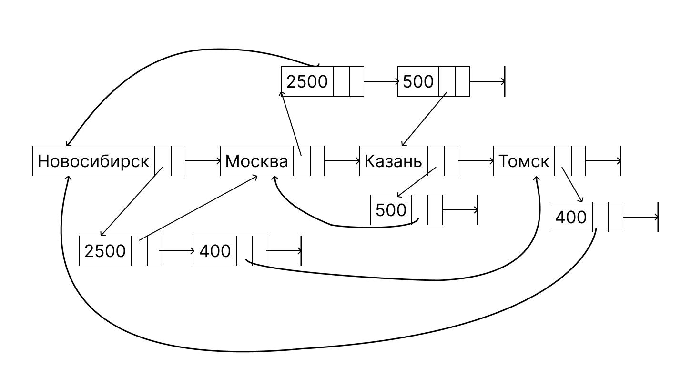
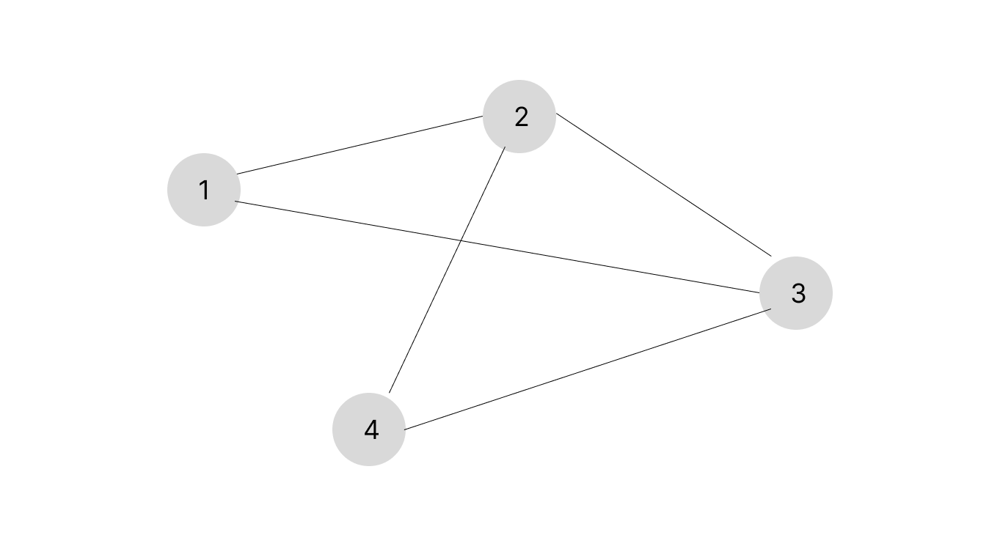
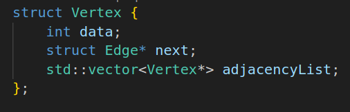
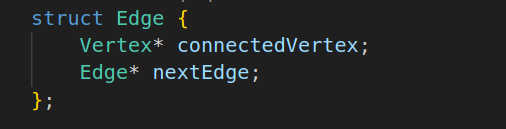
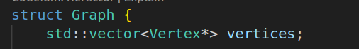
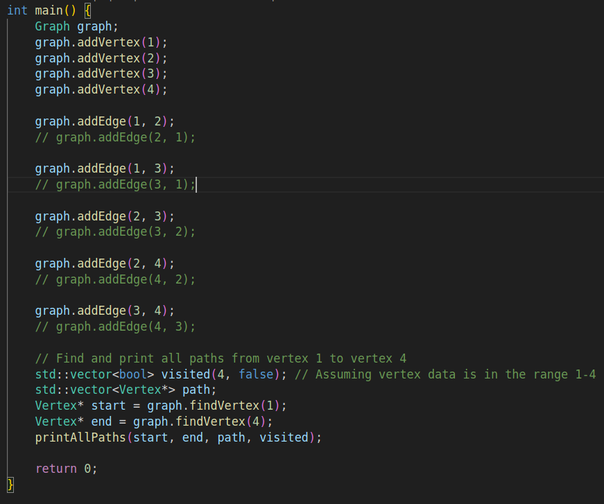

# Графы

## Структура данных - иерархический список.

### Граф - фигура которая состоит из вершин (точек) и ребер (отрезков) соединяющих их.

### Схема графа

Вершины - это города, ребра - дороги между ними. Числа - протяженность между городами.

## Блок схема графа

Создаем 3 структуры для более удобного восприятия задачи.

Добавим функции для создания графа.

## Контрольный пример

Для примерара создадим конкретный граф. У него 4 города. Цифрами обозначены города. Граф неорентированный, можно передвигаться в 2 направлениях.

Пример графа:

### Поиск путей

Найдем все пути из вершины 1 в 4. Программа для вывода путей выводит такой результат:

## Программа

Здесь представлена реализация поставленных задач на языке C++

### Структуры

### Найти вершину

### Добавить вершину

### Добавить ребро

### Удалить ребро

### Вывести все пути

### main

